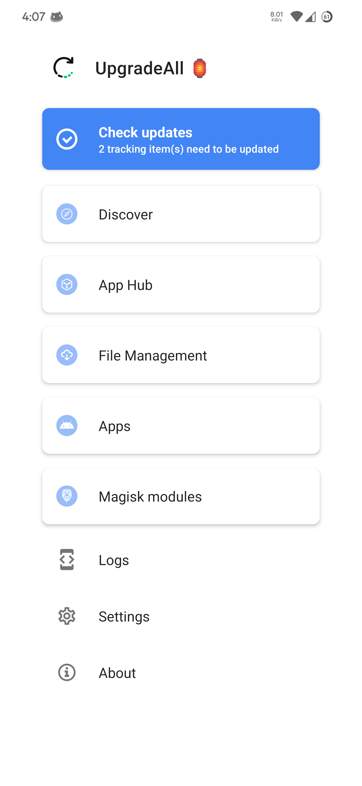
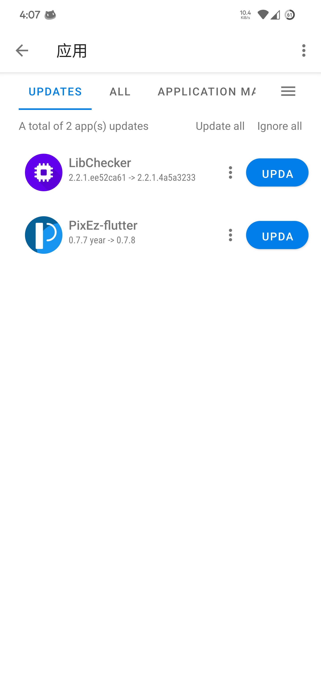

English | [简体中文](./source/RDME_zh.md)

# UpgradeAll

    
  
Check updates for Android apps, Magisk modules and more!
  

---

`UpgradeAll` is a free and open source software which simplifies the process of finding updates for Android apps (even if you didn't install them), Magisk modules and more. The main focus is on speed and ease of use, which is widely appreciated by users.

## 📚 Table of Contents
- [🙌 Let's get started](#-lets-get-started)
- [🎈 Features](#-features)
- [❓ FAQ](#-faq)
- [💬 Exchange Group](#-exchange-group)
- [📃 Developer Documentation](#-developer-documentation)
- [😊 Acknowledgements](#-acknowledgements)
- [♾️ Data sources](#%EF%B8%8F-data-sources)
- [🌐 Language Support](#-language-support)
  - [ℹ️ How to translate](#ℹ%EF%B8%8F-how-to-translate-upgradeall-to-your-language)
- [📖 License](#-license)
- [⚖️ Legal Notices](#%EF%B8%8F-legal-notices)
- [🧩 Screenshot](#-screenshot)

## 🙌 Let's get started

1. If you want to install `UpgradeAll`, first select a channel from above, find the latest version, download and install it.

2. Then open it, find app sources u need on `App Hub` page and switch them on.

3. After selecting the sources you want to use, return to Home page, go to `Discover` page and wait a moment, then find / search for the apps / modules you need.

4. Now, return to Home page and go to `Apps` page, you can see all the updates of your installed / added apps / modules.

- **The App market mode will automatically check for updates of your installed apps on open**

- You can also visit [here](https://github.com/DUpdateSystem/UpgradeAll/wiki) for a more detailed graphic tutorial.

## 🎈 Features
- Get updates from multiple sources.
- Download files via external downloader.
- Highly customizable rules.
- Modern and clean design.
- Supports Android 5.0 to 12L (Android 12L not tested).

## ❓ FAQ
During use of the application, you may encounter some problems, and this document may help you to solve them: [FAQ](https://github.com/DUpdateSystem/UpgradeAll/wiki/FAQ).

## 💬 Communication Group
You can join our communication group by clicking cards below:   

## 📃 Developer Documentation
All developer documentation for `UpgradeAll`, including the cloud directory structure, tracking entries, creating software source configurations, etc., is located in [Here](https://up-a.org/dev). If you find any documentation missing or incorrect, please raise an [Issue](https://github.com/DUpdateSystem/UpgradeAll/issues).

## 😊 Acknowledgements  
Many thanks to the developers of these libraries:

- [android-shell](https://github.com/jaredrummler/AndroidShell)
- [jsoup](https://jsoup.org/)
- [JsoupXpath](https://github.com/zhegexiaohuozi/JsoupXpath)
- [rhino](https://github.com/mozilla/rhino)
- [OkHttp](https://github.com/square/okhttp)
- [litepal](https://github.com/LitePalFramework/LitePal)
- [gson](https://github.com/google/gson)
- [maven-artifact](http://maven.apache.org/maven-artifact/)
- [commons-text](https://commons.apache.org/text/)

## ♾️ Data sources
Currently, the following sources are officially supported:
- [Github](https://github.com)
- [Gitlab](https://gitlab.com)
- [F-Droid](https://f-droid.org)
- [Play Store](https://play.google.com)
- [Coolapk](https://www.coolapk.com)
- [Source List](https://github.com/xz-dev/UpgradeAll-rules/)

## 🌐 Language Support
- Simplified Chinese
- Traditional Chinese
- English
- Brazilian Portuguese
- German

If you are familier with multiple languages, please help us introduce the App to the whole world!
### ℹ️ How to translate UpgradeAll into your language?
You can help us translate this project on [Crowdin](https://crowdin.com/project/upgradeall).

## 📖 License
Use of this software code is **subject to the following license agreement**:  
[GNU General Public License v3.0](https://github.com/DUpdateSystem/UpgradeAll/blob/master/LICENSE)

## ⚖️ Legal Notices
UpgradeAll（以下简称“本产品”）是一个集软件下载、更新于一体的工具。本软件提供的所有软件和资料均为软件作者提供及网友推荐发布，不得用于任何商业用途。本产品中提供的软件之著作权归软件作者所有。用户可以自由选择是否使用本产品提供的软件。如果用户下载、安装、使用本产品中所提供的软件，即表明用户信任该软件作者，本人对任何原因在使用本产品中提供的软件时可能对用户自己或他人造成的任何形式的损失和伤害不承担责任。任何单位或个人认为通过本产品提供的软件可能涉嫌侵犯其合法权益，应该及时向本人（邮箱：xiangzhedev@gmail.com）书面反馈，并提供身份证明、权属证明及详细侵权情况证明，本人在收到上述法律文件后，将会尽快移除被控侵权软件。本产品中的部分免费软件来源于互联网，由于某些原因我们没能联系上免费软件作者，如果软件作者对使用本产品提供下载、更新有任何异议，都欢迎与我们联系沟通。本人将在规定时间内给予删除等相关处理。因本产品引起的或与本产品有关的任何争议，各方应友好协商解决；协商不成的，任何一方均可将有关争议提交至南京仲裁委员会并按照其届时有效的仲裁规则仲裁；仲裁裁决是终局的，对各方均有约束力。

## 🧩 Screenshot

