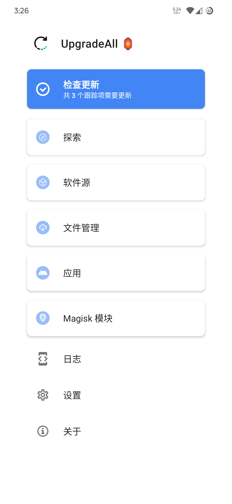
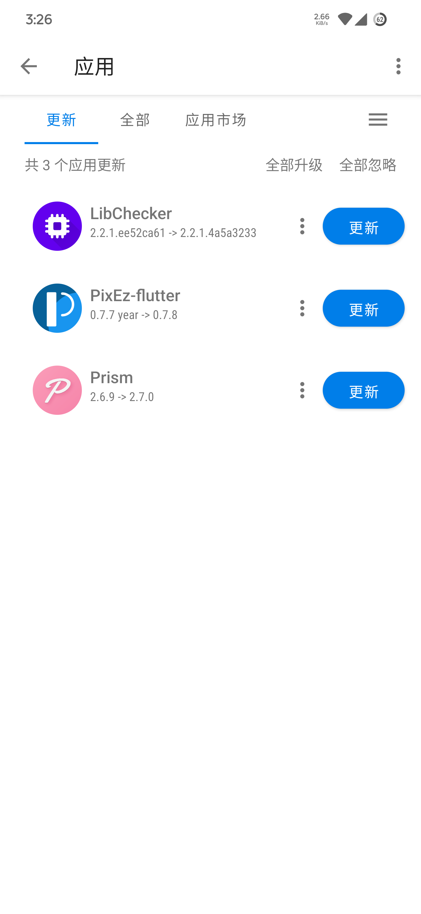

[英语](../README.md) | 简体中文

# UpgradeAll

    
  
检查 Android 应用，Magisk 模块以及其他更新！
  

---

`UpgradeAll` 是一款免费的开源软件，它简化了寻找安卓应用（即使您未安装）、Magisk模块等的更新过程。主打快捷和易用性，广受用户好评。

## 📚 目录
- [🙌 让我们开始吧](#-让我们开始吧)
-  [🎈 功能](#-功能)
- [❓ 常见问题](#-常见问题)
- [💬 交流群](#-交流群)
- [📃 开发者文档](#-开发者文档)
- [😊 鸣谢](#-鸣谢)
- [♾️ 数据源](#%EF%B8%8F-数据源)
- [🌐 语言支持](#-语言支持)
    - [ℹ️ 如何翻译](#ℹ%EF%B8%8F-如何将-upgradeall-翻译成您熟悉的语言)
- [📖 许可证](#-许可证)
- [⚖️ 法律声明](#%EF%B8%8F-法律声明)
- [🧩 截图](#-截图)
## 🙌 让我们开始吧

1. 如果想安装 UpgradeAll，先从上方选择一个渠道，找到最新版本并下载安装。

2. 然后打开它，在软件源中查看您想要使用的软件源并开启。

3. 在选择好需要使用的软件源后，回到主界面，进入探索页，稍等片刻，寻找 / 搜索您需要的软件 / 模块。

4. 现在，回到主界面，进入应用页，您可以看到所有您已安装 / 已添加应用的更新。

- **打开应用市场模式后会自动检查您已安装软件的更新**

- 您也可以前往 [此处](https://github.com/DUpdateSystem/UpgradeAll/wiki) 查看更详细的图文教程 。

## 🎈 功能
- 从多个来源获取更新。
- 通过外部应用下载文件。
- 高度可自定义规则。
- 现代且简洁的设计。
- 支持 Android 5.0 到 12L（Android 12L 未测试）。

## ❓ 常见问题
在应用的使用过程中，你可能会碰到一些问题，这篇文档也许可以帮助你解决遇到的困难：[常见问题](https://github.com/DUpdateSystem/UpgradeAll/wiki/FAQ)

## 💬 交流群
你可以点击下面的卡片来加入我们的交流群:  

## 📃 开发者文档
所有关于 `UpgradeAll` 的开发者文档，包括云端目录结构、跟踪项，软件源配置的编写等，都放在 [此处](https://upgradeall.now.sh/dev) 中，如果你发现有文档缺失或错误，请提交 [Issue](https://github.com/DUpdateSystem/UpgradeAll/issues) 说明。

## 😊 鸣谢  
非常感谢这些库的开发者:

- [android-shell](https://github.com/jaredrummler/AndroidShell)
- [jsoup](https://jsoup.org/)
- [JsoupXpath](https://github.com/zhegexiaohuozi/JsoupXpath)
- [rhino](https://github.com/mozilla/rhino)
- [OkHttp](https://github.com/square/okhttp)
- [litepal](https://github.com/LitePalFramework/LitePal)
- [gson](https://github.com/google/gson)
- [maven-artifact](http://maven.apache.org/maven-artifact/)
- [commons-text](https://commons.apache.org/text/)

## ♾️ 数据源
目前，有以下官方支持的源:
- [Github](https://github.com)
- [Gitlab](https://gitlab.com)
- [F-Droid](https://f-droid.org)
- [谷歌商店](https://play.google.com)
- [酷安](https://www.coolapk.com)
- [源列表](https://github.com/xz-dev/UpgradeAll-rules/)

## 🌐 语言支持
- Simplified Chinese
- Traditional Chinese
- English
- Brazilian Portuguese
- German

如果您会多种语言，请帮助我们翻译这个软件吧！

### ℹ️ 如何将 UpgradeAll 翻译成您熟悉的语言？

你可以在 [Crowdin](https://crowdin.com/project/upgradeall) 上翻译它。

## 📖 许可证
使用此软件代码需**遵循以下许可证协议**：  
[GNU General Public License v3.0](https://github.com/DUpdateSystem/UpgradeAll/blob/master/LICENSE)

## ⚖️ 法律声明
UpgradeAll（以下简称“本产品”）是一个集软件下载、更新于一体的工具。本软件提供的所有软件和资料均为软件作者提供及网友推荐发布，不得用于任何商业用途。本产品中提供的软件之著作权归软件作者所有。用户可以自由选择是否使用本产品提供的软件。如果用户下载、安装、使用本产品中所提供的软件，即表明用户信任该软件作者，本人对任何原因在使用本产品中提供的软件时可能对用户自己或他人造成的任何形式的损失和伤害不承担责任。任何单位或个人认为通过本产品提供的软件可能涉嫌侵犯其合法权益，应该及时向本人（邮箱：xiangzhedev@gmail.com）书面反馈，并提供身份证明、权属证明及详细侵权情况证明，本人在收到上述法律文件后，将会尽快移除被控侵权软件。本产品中的部分免费软件来源于互联网，由于某些原因我们没能联系上免费软件作者，如果软件作者对使用本产品提供下载、更新有任何异议，都欢迎与我们联系沟通。本人将在规定时间内给予删除等相关处理。因本产品引起的或与本产品有关的任何争议，各方应友好协商解决；协商不成的，任何一方均可将有关争议提交至南京仲裁委员会并按照其届时有效的仲裁规则仲裁；仲裁裁决是终局的，对各方均有约束力。

## 🧩 截图
